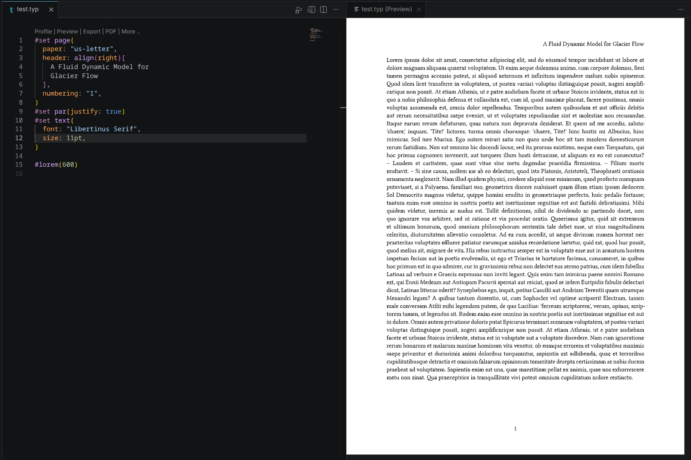

# CS138_WFW

This repository serves as the private repository for CS138 WFW 

As the syllabus states, the repository should contain the following
- Typesetted course notes  
- Compendium of solved problems
- *Summary cheat sheet* for exams


## Repository structure

```
CS138_WFW
├── cheat_sheet
│   ├── le1.typ
│   ├── le2.typ
│   └── le3.typ
├── class_notes
│   ├── le1
│   ├── le2
│   └── le3
├── compendium
│   ├── le1
│   ├── le2
│   └── le3
├── personal_files
└── resources
    ├── bibs
    │   ├── cheat_sheet
    │   ├── class_notes
    │   │   ├── le1
    │   │   ├── le2
    │   │   └── le3
    │   └── compendium
    │       ├── le1
    │       ├── le2
    │       └── le3
    └── images
        ├── cheat_sheet
        ├── class_notes
        │   ├── le1
        │   ├── le2
        │   └── le3
        └── compendium
            ├── le1
            ├── le2
            └── le3
```

## General guidelines

### Observe git hygiene

If you want to store files that only you use in the repository, kindly place them in the `personal_files` directory or mark it as hidden by prepending a `.` on the file name, these are ignored by git

    Example:
    personal_files/compiled_typst.pdf
    .hidden_file.kl

Place your contributions in its appropriate directory

### Naming Conventions
1. Directories and files must strictly follow snake_case convention so that files are neatly sorted for everyone

#### Class notes
For class note file names, try to follow the following structure: `topic.number_specific_topic.typ`
    
    Example:
    1.0_system_of_linear_algebra_equations.typ

- You can find the topic numbers for each topic in the syllabus

#### Compendium of solved problems
For the compendium of solved problems file names, follow the structure `topic.number_type_specific_topic.typ`

> `type` can be any of the following
> - quiz
> - homework
> - book_exercise
>
> and so on

```
    Example
    1.0_book_exercise_system_of_linear_algebra_equations.typ
```
    
- As much as possible, avoid taking problems from LLMs
- Wherever applicable, cite your sources (more on citation below)

#### Cheat sheet
Cheat sheet files should be named as is in the directory

### Stating your contributions
For all contributions except cheat sheets, follow the guide on how to use the typst template at the bottom of this page.

For the cheat sheet, all the names of the contributors and a brief description of what they contributed should be placed in a separate file

```
Contributor: Juan Dela Cruz
Contribution: <brief of contribution to cheat sheet>
```

### Resources

If you wish to have resources in your typst file, place them in the `resources` directory under the appropriate subdirectory
- Resource file name should mirror the path to the source file it would be linked to

```
    Example:
    resources/images/class_notes/le1/1.0_system_01.png
```

## Citation policy

Always cite your sources, that being said, here are the relevant resources for citing on typst. Use the APA format.

> Typst citation: https://typst.app/docs/reference/model/cite/

### Bibliographies

In order for you to add citations, you must have a bibiliography to reference (`.bib`). Create your bibliography in a path under`resources` that mirrors the location of your typst file

    Example:
    typst file  : class_notes/le1/file.typ
    bib file    : resources/bibs/class_notes/le1/file.bib

## Contributing

> [!IMPORTANT]
> Do not push directly to main

Instead, create a branch then submit a PR

## Typst typsetting

It is recommended to use typst for typsetting answers in this 
repository.

> Typst tutorial: https://typst.app/docs/tutorial/

> [!IMPORTANT]
> In order for each typst file to have uniform style throughout the repository, there will exist a shared `template.typ` file in the root directory that contributors import into their files. Details on how to use below
    
    Example:
    #import "../../template.typ": project

### Set-up for local viewing

**VS Code Extension**

Simply install `Tinymist Typst` extension in VS Code to have 
support for typst in your local machine

> Tinymist Typst: https://marketplace.visualstudio.com/items?itemName=myriad-dreamin.tinymist

You are basically set up once `Tinymist Typst` is installed.

 


Click on `Preview` to display the typst file in your VS Code.

**Typst cli**

For those who don't want to use VS Code for one reason or another, you can use the Typst CLI that typst themselves provide.

Follow the installation and usage guide in their github.

> Typst CLI: https://github.com/typst/typst

### Using template.typ

```typ
// 1. IMPORT: Loads the 'project' function from template.typ
#import "../../template.typ": project

// 2. SHOW RULE: Passes your entire file's content into the 'project' function
#show: project.with(
  title: "1.0 Systems of Linear Equations",
  contributor: "Juan Dela Cruz",
  date: "September 10, 2026",
)
```

